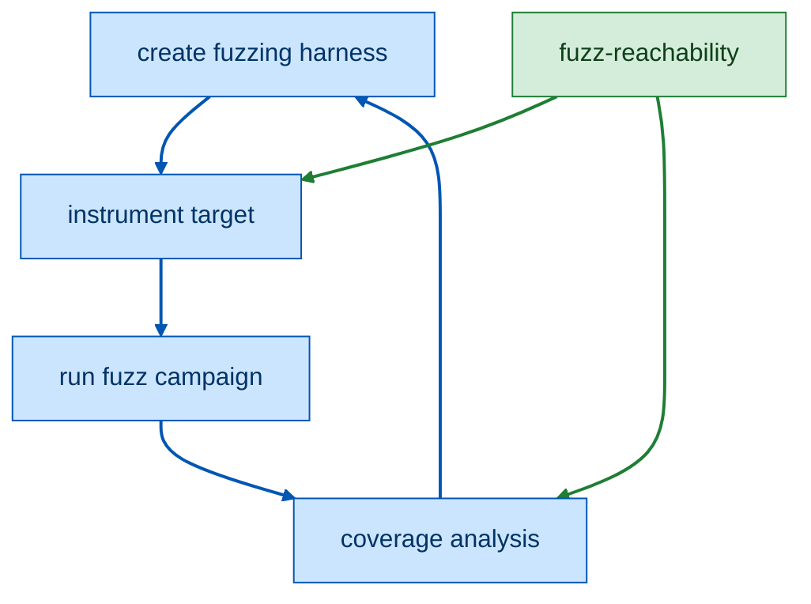

# Static Fuzz-Reachability Analyzer (C / C++ / Rust)

Given a project's build, this tool computes the set of functions a fuzz entry
point (`LLVMFuzzerTestOneInput`, a Rust cargo-fuzz target, or any entry you name)
can **statically reach**. It works uniformly across C, C++, and Rust — including
mixed-language projects — by analyzing merged LLVM bitcode.

The result is a **sound-leaning over-approximation**: it answers *which functions
can be reached*, not which ones ran. No function that is actually reachable is
ever reported unreachable. Over-reporting is expected and safe; under-reporting
is a bug.

**Deep dives:**
- Worked examples, step by step — a generic `LLVMFuzzerTestOneInput` harness for AFL++/libfuzzer (libxml2), a ziggy harness (the `url` crate), and cargo-afl harnesses (cpp_demangle and rustyknife) — [`docs/EXAMPLES.md`](docs/EXAMPLES.md)
- LLVM version support — [`docs/llvm-support.md`](docs/llvm-support.md)

Version: 1.1-dev

Author: Marc "vanHauser" Heuse

License: GNU AGPL v3 or newer


## How to use in a fuzzing campaign


### Instrument fuzzing target

Use the reachability information to only instrument what is reachable.
**Note that this is pointless in full link time optimization targets** (C/C++: `afl-clang-lto` or `-flto=full`, Rust: default) because this is already done by the compiler.

For AFL++ (AFL++ native LLVM plugins):
```
export AFL_LLVM_ALLOWLIST=$(pwd)/reached.txt
make/meson/ninja/cmake/...
```

For sancov (AFL++ sancov, libfuzzer, honggfuzz, etc.):
```
export CFLAGS="-fsanitize-coverage-allowlist=$(pwd)/reached.txt"
export CXXFLAGS="-fsanitize-coverage-allowlist=$(pwd)/reached.txt"
make/meson/ninja/cmake/...
```

#### Allowlist vs ignorelist — which is safe when bitcode is incomplete

Both lists are derived from the same reachable set (a sound-leaning
over-approximation). But when the analyzed bitcode is **incomplete** — a
precompiled library, the Rust standard library without `--build-std`, or an
assembly-only translation unit — a function can be genuinely reachable and
still have no body anywhere in the merged bitcode. Such a function shows up as
an `external_declarations` entry, not as a reachable function with a call
graph. Both list generators skip bodyless functions identically; it is the
allowlist-vs-ignorelist *semantics* whose consequence differs:

- **Allowlist (`reached.txt`)** only lists reachable functions that have a
  body in the bitcode. A reachable function with no body is **absent** from
  it, so `AFL_LLVM_ALLOWLIST=reached.txt` /
  `-fsanitize-coverage-allowlist=reached.txt` never instruments it — a
  coverage **blind spot** for code that genuinely runs.
- **Ignorelist (`not_reached.txt`)** only lists functions *proven*
  unreachable. The same bodyless function is not proven unreachable, so it is
  never added there, and `-fsanitize-coverage-ignorelist=not_reached.txt`
  still instruments it — *provided the coverage build actually compiles that
  function from source with the coverage pass*. For a genuinely precompiled
  library or an assembly-only unit there is no source recompiled through the
  instrumenting toolchain, so neither list recovers it: it stays
  uninstrumented under either flag.

**Recommendation:** default to the **ignorelist** as the conservative choice —
it can never exclude more than the allowlist would include, so it never turns
a reachable-but-bodyless function into a blind spot on its own. An LTO-free
build, `--static-libs auto` (the default, which analyzes each linked
bitcode-carrying archive in full), and, for Rust, `--build-std` all *shrink*
the external set — but they do not guarantee completeness. `--static-libs
auto` only recovers members of an archive that was itself compiled to bitcode
(via gllvm); it cannot manufacture bitcode for a binary blob or an asm-only
unit that was never compiled that way. Precompiled libraries and
assembly-only units therefore remain inherent limits (see
[Limitations](#limitations)). Check `summary.external_declarations` in the
JSON report (and the top-level `external_declarations` array, which names
them): a nonzero count means some reachable code sits outside the analyzed
bitcode regardless of flags, and no list can instrument what no build compiles
through the coverage pass.

### Coverage analysis

Use with [cov-analysis](https://github.com/AFLplusplus/cov-analysis) to see:
- what is reachable but not reached yet by the fuzzing corpus
- what is unreachable by the harness but should be fuzzed

```
cov-analysis report -d ../target-afl/out -e ./harness-cov -T 4 --reachability reachability.json
```


## How it works

```
 driver (Python)              analyzer (C++ / LLVM)
 ───────────────              ─────────────────────
   acquire bitcode ─┐
   C/C++ : gllvm    │   llvm-link    load .bc → build call graph →
   Rust  : rustc    ├─► merge .bc ─► resolve indirect calls → BFS from
   --emit=llvm-bc  ─┘                entry → JSON report + sancov lists
```

Two components, joined by merged bitcode:

- **Driver** (Python) — acquires bitcode per language, merges it with
  `llvm-link`, verifies the LLVM toolchain is version-coherent, and runs the
  analyzer.
- **Analyzer** (C++ linking LLVM) — loads the merged `.bc`, builds the call
  graph, resolves indirect calls (C function pointers, C++ virtual dispatch, Rust
  `dyn`/`fn` pointers), treats function pointers that escape to code outside the
  bitcode (handed to an external/indirect call or returned — e.g. qsort/bsearch
  comparators, atexit/pthread/`std::call_once` callbacks) as reachable, computes
  reachability from the entry, and emits a JSON report plus the two sancov lists.
  It demangles C++ (Itanium) and Rust names.

## Prerequisites

- **LLVM ≥ 21.** One coherent toolchain: `clang`, `clang++`, `llvm-link`,
  and the analyzer all share one major **M ≥ 21**, and rustc's LLVM is no newer
  than M. See [`docs/llvm-support.md`](docs/llvm-support.md).
  **NOTE!** especially as a Rust user, we recommend to install LLVM via
  https://apt.llvm.org/llvm.sh instead of the distribution, as those will be outdated!
- **Go** (to install `gllvm`), **Python ≥ 3.12**, and a **C++17** compiler. Rust
  targets also need **rustc / cargo** (nightly, but one using LLVM 21 or prior).
- [AFL++](https://github.com/AFLplusplus/AFLplusplus) compiled from commit 01a83a3d7098e605f0c7fd69381fcf4fc97144fe onwards (24 June 2026)
- [cov-analysis](https://github.com/AFLplusplus/cov-analysis) from commit 72c239038430477181df99f7a2cd0a556f2701dd onwards (23 June 2026)

## Install

The analyzer builds with a plain Makefile driven by `llvm-config` — no CMake.

```bash
bash scripts/setup.sh        # gllvm + rust-src, create .venv, build the analyzer
```

Or piecemeal:

```bash
make venv                    # create .venv (driver, editable + pytest)
make build                   # build the analyzer on the auto-selected LLVM (≥ 21)
make build LLVM_MAJOR=23     # ...or pin a specific major
make test                    # run the full test suite
make matrix                  # build + test against every installed LLVM ≥ 21
make help                    # list all targets
```

To run the CLI, point it at the built analyzer and put `gllvm` on `PATH`:

```bash
export REACHABILITY_ANALYZER=$PWD/analyzer/build/reachability-analyzer
export PATH="$(go env GOPATH)/bin:$PATH"     # gclang / gclang++ / get-bc
source .venv/bin/activate                    # or call .venv/bin/reachability directly
reachability check-toolchain                 # verify LLVM version coherence first
```

## Quick start

```bash
reachability run --lang <target> --project <dir> [--out <file>]
```

`--out` is optional; it defaults to `reachability.json` in the `--project`
directory. If `--out` points at an existing directory, the report is written
to `reachability.json` inside it.

`<target>` is a source language (`c`, `cpp`, `rust`, `mixed`) or a Rust fuzz
harness (`libfuzzer`, `ziggy`, `afl`). Each sets a default entry point, so the
common case needs no `--entry`. The build command and the artifact are
auto-detected for C/C++; override them with `--build-cmd` / `--artifact` when
needed.

Full options: [Command-line reference](#command-line-reference).

## Examples

Read about real-world target examples in [docs/EXAMPLES.md](docs/EXAMPLES.md)

### A C target

`fixtures/c_direct` is a small C fuzz target. Its build and artifact are
auto-detected:

```bash
reachability run --lang c --project fixtures/c_direct -v
```

```
reachable 3 / defined 4  (0 indirect-only, 0 low-confidence, 1 unreachable)  [backend=type-based]
```

`LLVMFuzzerTestOneInput → used_a → used_b` are reachable; `dead_fn` lands in
`unreachable_defined`.

### A C++ target (CMake)

`examples/cpp_cmake` uses virtual dispatch. The driver detects the CMake build,
wraps it with `gllvm`, and analyzes the resulting executable:

```bash
reachability run --lang cpp --project examples/cpp_cmake -v
```

The virtual call `Codec::decode` over-approximates to **both** overrides, reached
via indirect edges:

```
  Raw::decode(unsigned char const*, unsigned long) | via indirect
  Xor::decode(unsigned char const*, unsigned long) | via indirect
```

### A Rust target

`fixtures/rust_dyn` is a Rust `staticlib` whose `LLVMFuzzerTestOneInput`
dispatches through a `dyn Trait`. The driver builds it with
`RUSTFLAGS="--emit=llvm-bc …"` and collects the per-crate bitcode:

```bash
reachability run --lang rust --project fixtures/rust_dyn -v
```

The trait-object call resolves to both implementations, via indirect edges:

```
  <rust_dyn::Inc as rust_dyn::Op>::run | via indirect
  <rust_dyn::Dbl as rust_dyn::Op>::run | via indirect
```

### A mixed C + Rust target (cargo-fuzz shape)

`fixtures/mixed_c_rust` has C++ glue calling an `extern "C"` Rust entry. Use
`--lang mixed`; the driver builds and merges both sides' bitcode (gllvm for the
glue, cargo for Rust), and the cross-language edge resolves by C-ABI symbol name:

```bash
reachability run --lang mixed --project fixtures/mixed_c_rust \
  --artifact glue.o -v
```

Point `--artifact` at the C/C++ object so it is picked out from the Rust build
outputs.

### A target that links a static library

A tool linked against a static library (say `tools/thumbnail` linking
`libtiff.a`) embeds only the archive members the linker actually pulled in. To
analyze the **whole library** — not just the slice the linker kept — point
`--artifact` at the linked binary and keep the default `--static-libs auto`:

```bash
reachability run --lang c --project tiff-4.0.4/ --artifact tools/thumbnail -v
```

The driver merges `thumbnail`'s own objects with the full contents of
`libtiff.a`. Functions in members the linker discarded (e.g. `TIFFReadRGBAImage`,
`TIFFPrintDirectory`) now show up as unreachable instead of vanishing, while the
reachable set is unchanged from the linker's view — adding the rest of the
library can only add *unreachable* functions, never remove reachable ones. Use
`--static-libs none` for the linker's view only, or `all` to include every
bitcode archive in the tree.

### A ziggy harness

A [ziggy](https://github.com/srlabs/ziggy) harness is a Rust binary whose fuzz
loop lives in `main` rather than in `LLVMFuzzerTestOneInput`. `--lang ziggy`
builds it with its own driver (`cargo ziggy build --no-honggfuzz`) and roots at
`main` automatically:

```bash
reachability run --lang ziggy --project project/ziggy-harness/
```

Building through the fuzzer's own command (likewise `cargo afl build` for
`--lang afl`, `cargo fuzz build` for `--lang libfuzzer`) is deliberate: it sets
the same `cfg(fuzzing)`, optimization level, and instrumentation as the binary
you actually fuzz, so the reachable set matches it. Override the command with
`--build-cmd` (e.g. to pick a profile, sanitizer, or single target).

> For complete, start-to-finish walkthroughs on real targets — ziggy (the `url`
> crate), cargo-afl (cpp_demangle and rustyknife), and libFuzzer (libxml2)
> harnesses — see [`docs/EXAMPLES.md`](docs/EXAMPLES.md).

## Command-line reference

The `reachability` CLI has two subcommands.

### `reachability check-toolchain`

Resolves and validates the LLVM toolchain (analyzer, `clang`/`clang++`,
`llvm-link`, `rustc`) for version coherence and prints what it found. Run it
first; it exits non-zero on any incoherence. See
[`docs/llvm-support.md`](docs/llvm-support.md) for the policy.

### `reachability run`

Builds a project, merges its bitcode, and computes the reachable set from the
entry point(s).

| Option | Default | Meaning |
|--------|---------|---------|
| `--project DIR` | *(required)* | Project directory to build and analyze. |
| `--lang TARGET` | *(required)* | Target type (see the table below): sets how bitcode is acquired and the default entry. |
| `--out FILE` | `reachability.json` in `--project` | Path for the JSON report. A directory writes `reachability.json` into it. The two sancov lists default to `reached.txt` / `not_reached.txt` beside it. |
| `--entry NAME` | per `--lang` | Entry to root reachability at. **Repeatable**; overrides the target default. See [Entry resolution](#entry-resolution). |
| `--backend NAME` | *(none)* | Deprecated and ignored; the type-based backend is always used. Accepted for backward compatibility — passing it prints a warning. |
| `--artifact PATH` | auto-detect | C/C++ only: the built binary/object/archive to extract bitcode from (relative to `--project`). Auto-detected otherwise, preferring an executable over a shared library, archive, then object. |
| `--build-cmd CMD` | auto-detect | Shell build command. C/C++: run with `gllvm` injected, auto-detected otherwise (`configure` → `Makefile` → `CMakeLists.txt` → `build.ninja` → `meson.build`, else `make`); e.g. `"cmake -S . -B build && cmake --build build"`. An auto-detected build is forced static where the build system allows it (shared libraries are linked separately, so their bitcode never reaches the target): `--disable-shared`/`--enable-static` for `configure` when `configure --help` lists them, `-DBUILD_SHARED_LIBS=OFF` for CMake, `--default-library=static` for Meson. An auto-detected build also disables link-time optimization, since gllvm cannot embed bitcode under `-flto`: `-DCMAKE_INTERPROCEDURAL_OPTIMIZATION=OFF` for CMake, `-Db_lto=false` for Meson, and `--disable-lto` for `configure` when its `--help` lists an LTO toggle. If bitcode extraction still fails, the error names the likely cause (LTO, an afl-clang-fast/clang-LTO binary, a ccache/sccache layer, or assembly-only units) and its fix. Pass `--build-cmd` to override this entirely. `libfuzzer`/`ziggy`/`afl`: overrides the native build command (default `cargo fuzz build` / `cargo ziggy build --no-honggfuzz` / `cargo afl build`). |
| `--static-libs {auto,none,all}` | `auto` | C/C++ only: how to treat static archives (`.a`) the target links. `auto` also analyzes each linked archive in full, so members the linker dropped are reported rather than silently absent. `none` keeps only the linker's view. `all` includes every bitcode archive in the tree. Exact archive manifests prevent linked objects from being dropped; unresolved duplicate definitions fail the merge instead of silently replacing one body. |
| `--profile {debug,release}` | tool default | Build profile. `libfuzzer`/`ziggy`/`afl`: `release` adds `--release` to the native command (else the tool's default). Plain `--lang rust`: the cargo profile (default `debug`). See [Matching the fuzz binary's build](#matching-the-fuzz-binarys-build). |
| `--codegen-units N` | auto | Plain `--lang rust` only (positive integer): rustc `-Ccodegen-units`, auto-detected from `Cargo.toml` else cargo's per-profile default. Ignored for `libfuzzer`/`ziggy`/`afl` (their build sets it). See [Matching the fuzz binary's build](#matching-the-fuzz-binarys-build). |
| `--optimize` | off | Build the analysis at the target's real optimization (post-inline). By default the analysis build is **source-faithful**: C/C++ analysis bitcode is built with `-fno-inline -fno-inline-functions` (via `LLVM_BITCODE_GENERATION_FLAGS`); Rust with `-Copt-level=0` (via composed `RUSTFLAGS` for plain `--lang rust`/`mixed`, or via `RUSTC_WRAPPER` for native harnesses). Functions are not inlined away, so the reachable set matches what `llvm-cov` reports and is a safe allowlist superset. For native Rust harnesses (`libfuzzer`/`ziggy`/`afl`), `--optimize` also skips the post-analysis clean (otherwise their throwaway opt-0 build is discarded). Pass `--optimize` when you want the set and per-function metrics to mirror a specific `-O3` instrumented binary. Controls inlining only — LTO is still stripped. |
| `--build-std` | off | Rust only: build the standard library from source with Cargo's `-Zbuild-std` option and rustc's detected host target, so std functions appear in the graph instead of as external declarations. |
| `--clean` | off | Remove cached build artifacts and prior outputs under `--project` before building, so the run rebuilds from clean (a cached build otherwise yields stale or empty bitcode — see [Matching the fuzz binary's build](#matching-the-fuzz-binarys-build)). Rust runs `cargo clean` (also in `fuzz/` for cargo-fuzz); C/C++ runs the build system's own clean (`make`/`ninja`/`cmake`/`meson`) in each configured build tree and removes `*.o`/`*.bc` files (build directories are kept, since some projects build in-source); every target also drops `merged.bc` and any prior `reachability.json` / `reached.txt` / `not_reached.txt` / `--dot`. |
| `--dot FILE` | *(none)* | Also write the reachable subgraph as Graphviz DOT (indirect edges dashed/red). |
| `--reached FILE` | beside `--out` | Path for the sancov **allowlist** of reachable functions. |
| `--not-reached FILE` | beside `--out` | Path for the sancov **ignorelist** of unreachable functions. |
| `-v`, `--verbose` | off | Narrate each pipeline stage (toolchain → build → merge → analyze): echoes the tool commands run, streams the build output live, and lists the collected bitcode modules. |

#### Target types (`--lang`)

| `--lang` | acquires via | default entry |
|----------|--------------|---------------|
| `c` | gllvm (`gclang`) | `main` + `LLVMFuzzerTestOneInput` |
| `cpp` | gllvm (`gclang++`) | `main` + `LLVMFuzzerTestOneInput` |
| `rust` | `cargo build` + `--emit=llvm-bc` | `main` |
| `mixed` | gllvm **and** cargo (merged) | `LLVMFuzzerTestOneInput` |
| `libfuzzer` | `cargo fuzz build` | `fuzz_target!` |
| `ziggy` | `cargo ziggy build --no-honggfuzz` | `main` |
| `afl` | `cargo afl build` | `main` |

`libfuzzer`/`ziggy`/`afl` build through the fuzzer's own driver (a `RUSTC_WRAPPER`
adds `--emit=llvm-bc`), so the bitcode carries the real `cfg(fuzzing)`, opt level,
and instrumentation; `--build-cmd` overrides the command. `rust`/`mixed` use a
plain `cargo build`, tunable with `--profile` / `--codegen-units`.

The C/C++ targets root at both `main` and `LLVMFuzzerTestOneInput`, so one
`--lang c`/`cpp` covers a normal program and an LLVMFUzzerTestOneInput harness alike. A default
entry that matches nothing is a harmless warning, because roots are unioned.

#### Entry resolution

`--entry` never requires a mangled symbol. A token matches — unioned across all
of:

- an exact mangled symbol (e.g. `_Z3foov`),
- an exact demangled name (e.g. `foo()`),
- a demangled `::name` suffix (so `main` finds `crate::main`), and
- the alias `fuzz_target!` (→ `LLVMFuzzerTestOneInput` + `rust_fuzzer_test_input`).

Matching more than one function only adds roots, which stays sound. For a Rust
binary, just root at `main`: the token matches the real Rust `main`, so you never
need to type a mangled symbol.

#### Matching the fuzz binary's build

The reachable set must be computed from a build that matches the binary you
instrument: the optimization level, `cfg(fuzzing)`, feature flags, and
`debug_assertions`/`overflow_checks` all change *which* functions are compiled,
which wildcard `fun:` patterns cannot recover.

**For `c`/`cpp` targets**, reachability is **optimization-independent by
default**: gllvm emits the analyzed bitcode with heuristic inlining suppressed
(`-fno-inline -fno-inline-functions`), so the reachable set does not depend on
the project's `-Ox` level and inlined-away functions are still reported —
matching what `llvm-cov` sees, and a safe allowlist superset. Pass
**`--optimize`** to instead analyze at the build's real optimization, so the
reachable set and per-function metrics mirror a specific instrumented binary;
inlining then governs both, and when a callee is inlined its basic blocks,
loops, locals (`C11`) and `dangerous_calls` fold into the caller (see
[Function metrics](#function-metrics)). **AFL++'s `afl-cc`/`afl-clang-fast`
default to `-O3`**; sancov-based harnesses (libFuzzer, honggfuzz) use whatever
`-Ox` you give their compiler. So under `--optimize`, when the fuzz binary is a
default AFL++ build, analyze at `-O3` too — e.g.
`CFLAGS=-O3 CXXFLAGS=-O3 reachability run --optimize …`.

**For `libfuzzer`/`ziggy`/`afl`, Rust reachability is now source-faithful by
default**: the native harness build is forced to `-Copt-level=0` (the
`RUSTC_WRAPPER` appends it as an extra argument to every `rustc` invocation), so functions the optimizer
would inline still appear in `reachability.json`/`reached.txt` and match what
`llvm-cov` reports. Native runs then clean their throwaway opt-0 build afterward
(`cargo ziggy clean` / `cargo afl clean` / `cargo clean` in `fuzz/` for
cargo-fuzz) so no mis-optimized instance is left to be fuzzed by mistake — which
means your next real fuzzing build recompiles. `--profile release` adds `--release` for the non-optimization
aspects (feature flags, profile settings); `--build-cmd` overrides the command
for anything finer (a specific target, sanitizer, or profile). `--codegen-units`
does not apply (the tool sets it). `--optimize` restores the optimized, post-inline
build and skips the post-analysis clean.

**For plain `--lang rust`/`mixed`, Rust reachability is now source-faithful by
default**: the analysis build forces `-Copt-level=0` via composed `RUSTFLAGS`,
so functions the optimizer would inline still appear in `reachability.json` and
match what `llvm-cov` reports. `--profile release` no longer changes the reachable
set (since opt-level is always zero) unless `--optimize` is also passed, which
restores the optimized/post-inline view. Matching the fuzz binary's features,
`cfg(fuzzing)`, `debug_assertions`, and `overflow_checks` still requires setting
the profile/features/env correctly.

`cargo-afl` and `ziggy` builds run with `AFLRS_REQUIRE_PLUGINS=1`, so they fail
loudly when the AFL++ LLVM plugins are missing rather than silently building with
weaker instrumentation that would not match your real fuzzer; install them with
`cargo afl config --build --plugins --force`.

A build only emits bitcode for the crates it actually (re)compiles, so a **cached
build yields nothing**. The driver detects this — a fully cached run aborts with a
clear "build was CACHED" error — so `cargo clean` (or remove `fuzz/target` for
cargo-fuzz) before the run, or pass **`--clean`** to have the driver do it for you
(it runs `cargo clean`, also in `fuzz/`, before building). (Setting `RUSTC_WRAPPER`
forces a rebuild the first time; a second consecutive run is the cache hit that
trips the check.)

For **plain `--lang rust`** the driver runs `cargo build --emit=llvm-bc`, and two
options match it to the fuzz binary (both ignored for C/C++); their defaults aim
at a stock cargo build.

- **`--profile {debug,release}`** (default `debug`) — the cargo profile. The
  optimization level drives generic *sharing* (rustc's `-Zshare-generics` is on
  when unoptimized, off when optimized): it decides which crate instantiates each
  generic, and so which monomorphizations exist and how they are mangled. A
  debug snapshot against a release fuzz binary (or vice versa) therefore produces
  a different function set. Pass `--profile release` for an optimized fuzz build.
  There is no manifest "default profile" in cargo (the profile is picked by the
  build command), so when omitted this defaults to `debug` — cargo's own default
  for a bare `cargo build`.

- **`--codegen-units N`** — passed through verbatim as rustc `-Ccodegen-units`.
  The unit count sets inlining boundaries, hence which monomorphizations survive
  as standalone functions rather than being inlined away. `N` is any **positive
  integer** (rustc rejects `0`/negative). When **omitted it is auto-detected** to
  match how cargo would build the chosen profile:
  1. the project's `Cargo.toml` `[profile.<name>] codegen-units` — searched from
     `--project` up to the workspace root, since cargo honours the root
     manifest's profiles (`<name>` is `dev` for `--profile debug`, else
     `release`); otherwise
  2. cargo's per-profile default — **256** for `debug` (dev), **16** for
     `release`.

  Common explicit value: **`1`** — a single unit per crate (maximum inlining, one
  `.bc` per crate). Many fuzzing setups pin `codegen-units = 1`; if your
  `Cargo.toml` does, auto-detect already picks it up, so you rarely need the flag.
  With `N` > 1 rustc splits each crate into several
  `target/<profile>/deps/<crate>-<hash>.<cgu>.rcgu.bc` files; the driver collects
  all of them.

**How to choose.** Usually you do not have to: set `--profile` to your fuzz
build's profile and codegen-units auto-detects the rest from `Cargo.toml`.
Override `--codegen-units` only when the fuzz binary is built with a value that
is neither in the manifest nor the cargo default for that profile (e.g. one
forced via `-Ccodegen-units` in `RUSTFLAGS`). `-v` prints the resolved
`profile=… codegen-units=…` so you can confirm the match.

The `fun:` patterns in the lists already tolerate the Rust mangling
*disambiguator* (`17h<hash>`) drifting between builds (see [Output](#output)), but
that only covers the *naming* of a given instance. Matching `--profile` /
`--codegen-units` is what aligns the *set* of emitted functions; a wildcard
cannot recover a function that one build inlined away and the other did not.

#### Environment variables

| Variable | Purpose |
|----------|---------|
| `REACHABILITY_ANALYZER` | Path to the analyzer binary (default `analyzer/build/reachability-analyzer`). |
| `CLANG` / `CLANGXX` / `LLVM_LINK` / `OPT` | Override individual tool paths (otherwise resolved by major from the analyzer's LLVM). |
| `PATH` | Must contain `gclang` / `gclang++` / `get-bc` (gllvm) for C/C++/mixed targets. |

## Output

`reachability run` writes three files:

- **`<out>.json`** — `summary` counts (including `low_confidence` and
  `external_declarations`), a `reachable`
  array (mangled and demangled name, a `key` (the mangled name with the Rust
  `17h<hash>` disambiguator stripped — the build-independent join key
  cov-analysis uses), source file/line when debug info is present,
  `via` = `direct`/`indirect`/`both`, an `indirect_only` flag, a `confidence`
  of `high`/`medium`/`low` — see [Confidence](#confidence) — and a `depth`: the
  fewest call-graph hops from the nearest entry, with entries at `0` and the
  shortest path winning when several reach the same function), an
  a set of per-function triage metrics — see [Function metrics](#function-metrics)),
  an `unreachable_defined` array, a top-level `external_declarations` array
  (sorted mangled names of reachable functions with no body in the analyzed
  bitcode — precompiled libs, Rust std without `--build-std`, asm units;
  `summary.external_declarations` is its count), and an `edges` array — the
  reachable call graph as
  `{ "from", "to", "kind" }` objects (`kind` = `direct`/`indirect`), restricted to
  edges whose endpoints are both reachable. With `--dot FILE`, also the reachable
  subgraph in Graphviz form.
- **`reached.txt`** — a SanitizerCoverage **allowlist** of reachable functions.
- **`not_reached.txt`** — a SanitizerCoverage **ignorelist** of unreachable
  functions.

Both lists use each function's **mangled** (LLVM symbol) name — what clang and
AFL++ match `fun:` against — so they cover C, C++, and Rust. Feed either to clang
or AFL++ to instrument only reachable code:

```bash
# instrument ONLY reachable functions:
clang -fsanitize-coverage=trace-pc-guard -fsanitize-coverage-allowlist=reached.txt ...
# OR: instrument everything EXCEPT unreachable functions:
clang -fsanitize-coverage=trace-pc-guard -fsanitize-coverage-ignorelist=not_reached.txt ...
```

> A coverage allowlist instruments a function only when both a `src:` and a
> `fun:` entry match, so `reached.txt` opens with a `src:*` line. An ignorelist
> has no such requirement, so `not_reached.txt` is pure `fun:` lines. (Verified
> against clang in `driver/tests/test_covlists.py`.)

> **Rust mangling disambiguator.** A Rust generic instance is mangled with a
> trailing `17h<hash>` disambiguator that is not guaranteed stable across builds
> (e.g. when a generic is instantiated from a different crate). rustc documents
> no such guarantee, so the exact value can differ between this bitcode snapshot
> and the instrumented fuzz binary, and an exact-name entry could miss.
> `driver/tests/test_rust_hash_stability.py` builds one crate at two opt levels
> and checks that the JSON `key` (the disambiguator stripped) stays identical,
> even where the raw disambiguator does not. The build-independent `key` in the JSON report
> (see above) is therefore the sanctioned join across builds; each `fun:` entry
> in the text lists gets the same tolerance by replacing the disambiguator with
> a `*` glob,
> which both clang sancov and AFL++ honour, so an entry matches the instance in
> any build. An ignorelist pattern that would also match a *reachable* instance
> is dropped, so excluding unreachable code never excludes reachable code.
> The `*` only tolerates the disambiguator, not a different function *set*, so
> still build the snapshot like the fuzz binary — automatic for
> `libfuzzer`/`ziggy`/`afl`, or matched via `--profile`/`--codegen-units` for
> plain `--lang rust` (see
> [Matching the fuzz binary's build](#matching-the-fuzz-binarys-build)).
>
> **This normalization only covers legacy mangling.** The `17h<hash>`
> pattern above is specific to Rust's *legacy* mangling scheme. Under the
> **v0** scheme (symbols starting `_R…` — forced by `-Cinstrument-coverage`,
> and opt-in via `-Csymbol-mangling-version=v0`), the
> disambiguator has a different shape that `canonicalKey`/`toPattern` do not
> recognize, so the normalization is a no-op: `key` is identical to the raw
> mangled name, and the text-list entry keeps its exact name instead of
> gaining a `*`. A tool joining this report against a v0-mangled build by
> name or `key` alone can therefore miss instances whose disambiguator
> differs between builds. For legacy-mangled sancov builds this is not a
> correctness gap — the `*` glob tolerates the drifting disambiguator, and
> the sancov instrument-time build is legacy-mangled in practice (it is not
> `-Cinstrument-coverage`), so its `fun:` entries match. Under a v0-mangled
> build there is no glob, so a disambiguator that drifts between the
> analysis snapshot and the fuzz binary can cause an exact-name miss (a
> blind spot) — matching the build (profile/codegen-units) minimizes this,
> and full v0-aware normalization is a future enhancement; it also affects
> consumers that must match a `-Cinstrument-coverage` build by name across
> two independently-mangled builds, e.g.
> [cov-analysis](https://github.com/AFLplusplus/cov-analysis)'s
> `--reachability` JSON-mode join, which falls back to source `file`/`line`
> matching in that case (see its docs). See [Limitations](#limitations).

## Indirect-call resolution

Indirect calls (C function pointers, C++ virtual dispatch, Rust `dyn`/`fn`
pointers) are resolved by the **type-based** resolver: an indirect call of
function type `T` may reach any address-taken function whose LLVM function type
is `T`. It is language-agnostic, always available, and sound — a deliberate
over-approximation. The `--indirect-any` debug flag widens this further, to any
address-taken function regardless of type.

See [`docs/llvm-support.md`](docs/llvm-support.md) for the LLVM compatibility
matrix.

## Reachability through runtime symbol lookup

A function can be reached with no call edge in the bitcode at all: code that
resolves a symbol **by name** at run time — `dlsym`/`dlvsym`/`dlopen`/`dlmopen`
on Unix, `GetProcAddress` on Windows — and calls the result. The target then has
no direct caller, no taken address, and nothing for the type-based or escape
resolvers to latch onto; its only tie to the program is the **string constant**
holding its name.

The analyzer recovers these. When the module actually performs such a lookup,
any **defined, externally visible** function whose symbol name appears verbatim
as a string constant is added as a reachability **root**. External visibility is
required because `dlsym` only resolves symbols in the dynamic symbol table, which
excludes `internal` functions; gating on the presence of a lookup keeps the
heuristic inert for programs that never resolve by name. Like every root, this
only widens the sound over-approximation. The `--no-name-roots` flag disables it.

(`fixtures/rust_indirect` exercises this with a `dlsym`-resolved `#[no_mangle]`
target; see also `driver/tests/test_analyzer_core.py`.)

## Confidence

The type-based resolver is a sound over-approximation, so some reachable
functions are reported only because a function of their type is called somewhere
and their address was taken — not because their address demonstrably reaches a
call. Each reachable function in the JSON therefore carries a `confidence`:

- **`high`** — reached by a concrete direct call (or it is a root). The IR
  literally calls it.
- **`medium`** — reached only indirectly, but value-flow shows the address is
  used as a callable: it reaches the callee operand of an indirect call (through
  globals, vtables, tables, `select`/`phi`, loads/stores), or it escapes as an
  argument/return to external code that may call it (`qsort`, `signal`,
  `pthread_create`, …).
- **`low`** — reached only by a *type match*, with no value-flow evidence the
  address is ever used as a callable. This is the soft, likely-spurious surface
  of the over-approximation (e.g. a function pointer that is only taken, cast to
  an integer, and stored or XOR-ed but never called). `summary.low_confidence`
  counts these.

It is computed by re-running the escape value-flow rooted at indirect callee
operands and at non-asm, non-intrinsic escapes; inline asm (`std::hint::black_box`
lowers to empty `asm sideeffect ""`) and intrinsics (`llvm.lifetime`, `memcpy`,
`dbg`, …) observe or move a value but cannot invoke it, so they do not count as
callable sinks.

**`confidence` is a triage hint, not a verdict.** It never changes the reachable
set: `reached.txt` and `not_reached.txt` are unaffected, and a `low` function
stays in the allowlist. The signal is heuristic on purpose — a *genuine* target
whose address is laundered through integer arithmetic (`ptrtoint`→`inttoptr`),
reached only via an inline-asm `call`, or invoked only as a startup constructor
can rate `low`; conversely a true decoy whose address escapes to a real callable
sink can rate `medium`. Treat `low` as "worth auditing", not "safe to remove".
(See `driver/tests/test_analyzer_core.py::test_confidence_tiers`.)

## Function metrics

Each reachable function in the JSON carries a set of static triage signals to
help decide where a fuzzing campaign should focus. Like `confidence`, these are
hints, never verdicts — they do not change the reachable set or the coverage
lists. By default they are computed on a source-faithful build (heuristic inlining
suppressed), so the counts reflect functions as written. Pass `--optimize` to
compute them on the optimized/post-inline bitcode that mirrors the instrumented
binary — there an inlined callee's basic blocks, loops, locals (`C11`) and
`dangerous_calls` fold into the caller, so an `-O3` `main` can report several
times the counts of its source.

- **`basic_blocks`** — number of basic blocks in the function.
- **`cyclomatic`** — cyclomatic complexity, `edges - blocks + 2` (minimum `1`).
- **`loops`** — number of natural loops (counts nested loops too).
- **`dangerous_calls`** — number of call sites to known memory-unsafe functions
  (`memcpy`/`memmove`/`memset` and the `llvm.mem*` intrinsics, `strcpy`/`strcat`
  and friends, `sprintf` family, `gets`, `scanf` family, `alloca`, the
  `malloc`/`calloc`/`realloc` allocators, …). The list is the editable text file
  [`dangerous_functions.txt`](dangerous_functions.txt) at the project root: one
  name per line, `#` comments, a trailing `*` for a prefix match. It is compiled
  into the analyzer, so edit it and rebuild (`make build`) to change the set.
- **`C11`** — number of local variables. From debug info (`DILocalVariable`
  entries, excluding parameters) when the bitcode carries it; otherwise it falls
  back to the count of `alloca` instructions. Build with `-g` for the accurate
  source-level count, since optimization promotes most locals out of `alloca`s.
- **`interesting`** (boolean) — the function takes at least one pointer argument
  **and** lies on a call-graph path from an entry along which *every* function
  also takes a pointer argument. It flags code the fuzzer's input (a pointer) can
  plausibly be threaded into through an unbroken chain of pointer-passing calls. A
  function with a pointer argument whose only callers are non-pointer-taking is
  `false`.
- **`bottleneck`** (boolean) — the function is the immediate dominator of at
  least one other reachable function in the call graph rooted at the entries:
  every path from an entry to that other function passes through it. A bottleneck
  gates a region of the reachable graph, so leaving it uncovered leaves the whole
  region uncovered — a high-value target for seeds or harness fixes.
- **`dead_end`** (boolean) — the function calls no `interesting` function: either
  it makes no calls at all (a call-graph leaf), or every function it calls is
  `interesting = false`. It marks where the pointer-carrying `interesting` chain
  terminates — input flow goes no deeper past a dead end.

(See `driver/tests/test_analyzer_core.py::test_function_metrics_counts`,
`::test_interesting_pointer_path`, `::test_bottleneck_dominators`, and
`::test_dead_end`.)

## Historical note: the removed SVF backend

Earlier versions shipped an optional second backend, `--backend=svf`, built on
[SVF](https://github.com/SVF-tools/SVF)'s Andersen points-to analysis, meant to
narrow the type-based over-approximation per call site. It was removed: in
practice it produced essentially the same reachable sets as the default
type-based backend while costing far more. It built only against a pinned LLVM
21 (it failed on 22/23), required a separately vendored SVF + Z3 build with a
local source patch, ran substantially slower, and was more fragile to operate —
so it offered no practical benefit over the type-based backend, which is sound,
language-agnostic, and works on every supported LLVM. The `--backend` flag is
retained only for backward compatibility: it is accepted but ignored (with a
warning).

## Testing

```bash
make test       # full pytest suite (analyzer .ll goldens + per-language soundness)
make matrix     # LLVM version-compatibility matrix (catches future-LLVM breakage)
```

Each fixture in `fixtures/` carries a `must_reach` / `must_not_reach` set; every
backend must satisfy the soundness invariant on each.

## Project layout

```
analyzer/   C++ analyzer + Makefile (src/, built via llvm-config)
driver/     Python driver (toolchain, acquire_*, link, analyze, cli)
fixtures/   per-language test targets with expected reachable sets
examples/   worked examples (cpp_cmake/)
scripts/    setup.sh, test_matrix.sh, select_llvm.sh
docs/       worked examples (EXAMPLES.md), LLVM support
```

## Limitations

This is a static over-approximation, not dynamic coverage. Its precision is
bounded by indirect-call resolution and by any missing bitcode — precompiled
libraries, or the Rust standard library without `--build-std`.

**Callbacks that escape to external code.** A function pointer is treated as
reachable when it is handed to an external/indirect call as an argument, or
returned (qsort/bsearch comparators, atexit/pthread/`std::call_once` callbacks,
etc.). The escape analysis follows local loads/stores, globals, aggregates,
select/PHI values, defined wrapper arguments, and defined functions that return
callbacks.

**v0 Rust mangling disambiguator is not normalized (future enhancement).**
The build-independent `key` and the `fun:` pattern-list `*` glob (see
[Output](#output)) only recognize the *legacy* Rust mangling scheme's
`17h<hash>` disambiguator; under the **v0** scheme (`_R…`, forced by
`-Cinstrument-coverage`) they are inert, so a name/key join against a
v0-mangled build can miss instances whose disambiguator differs between
builds. Consumers that also have source location can work around this via a
`file`/`line` fallback (cov-analysis's JSON mode does this). A v0-demangler-aware
disambiguator stripper — the v0 analogue of the legacy-mangling fix above —
would close this gap but is not implemented; it is planned as a future
enhancement and would likely warrant its own plan spanning both
fuzz-reachability and any downstream consumer's shared normalization code.
